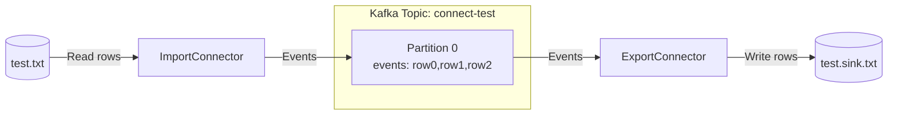
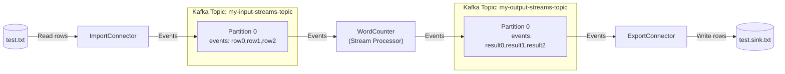

# Konektori

```mermaid
flowchart LR

    Source[("test.txt")]

    Import["ImportConnector"]

    subgraph Kafka Topic: connect-test
        P0["Partition 0
        events: row0,row1,row2"]
    end

    Export["ExportConnector"]

    Sink[("test.sink.txt")]

    Source -->|"Read rows"| Import

    Import -->|"Events"| P0

    P0 -->|"Events"| Export

    Export -->|"Write rows"| Sink
```

## Konektor i stream procesor

```mermaid
flowchart LR

    Source[("test.txt")]

    Import["ImportConnector"]

    subgraph Kafka Topic: my-input-streams-topic
        P0["Partition 0
        events: row0,row1,row2"]
    end

    WordCounter["WordCounter
    (Stream Processor)"]

    subgraph Kafka Topic: my-output-streams-topic
        P1["Partition 0
        events: result0,result1,result2"]
    end

    Export["ExportConnector"]

    Sink[("test.sink.txt")]

    Source -->|"Read rows"| Import

    Import -->|"Events"| P0

    P0 -->|"Events"| WordCounter

    WordCounter -->|"Events"| P1

    P1 -->|"Events"| Export

    Export -->|"Write rows"| Sink
```
