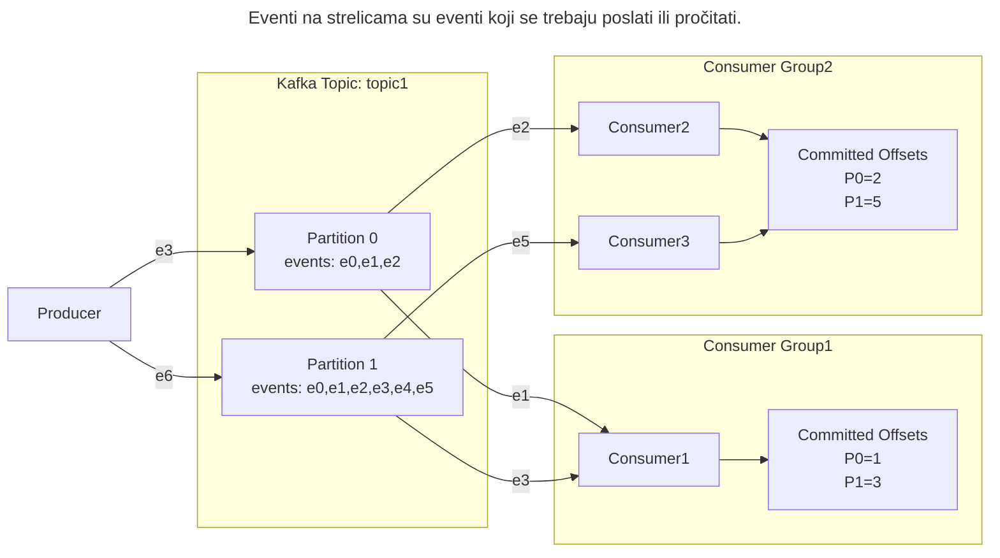

# Kafka Mermaid Example

```mermaid
---
title: Eventi na strelicama su eventi koji se trebaju poslati ili pročitati.
---
flowchart LR

    P[Producer]

    subgraph Kafka Topic: topic1
        P0["Partition 0
            events: e0,e1,e2"]
        P1["Partition 1
            events: e0,e1,e2,e3,e4,e5"]
    end

    P -->|"e3"| P0
    P -->|"e6"| P1

    subgraph Consumer Group1
        Consumer1[Consumer1]
        Group1Off["Committed Offsets<br/>P0=1<br/>P1=3"]
    end

    subgraph Consumer Group2
        Consumer2[Consumer2]
        Consumer3[Consumer3]
        Group2Off["Committed Offsets<br/>P0=2<br/>P1=5"]
    end

    P0 -->|"e1"| Consumer1
    P1 -->|"e3"| Consumer1
    Consumer1 --> Group1Off

    P0 -->|"e2"| Consumer2
    P1 -->|"e5"| Consumer3
    Consumer2 --> Group2Off
    Consumer3 --> Group2Off
```
