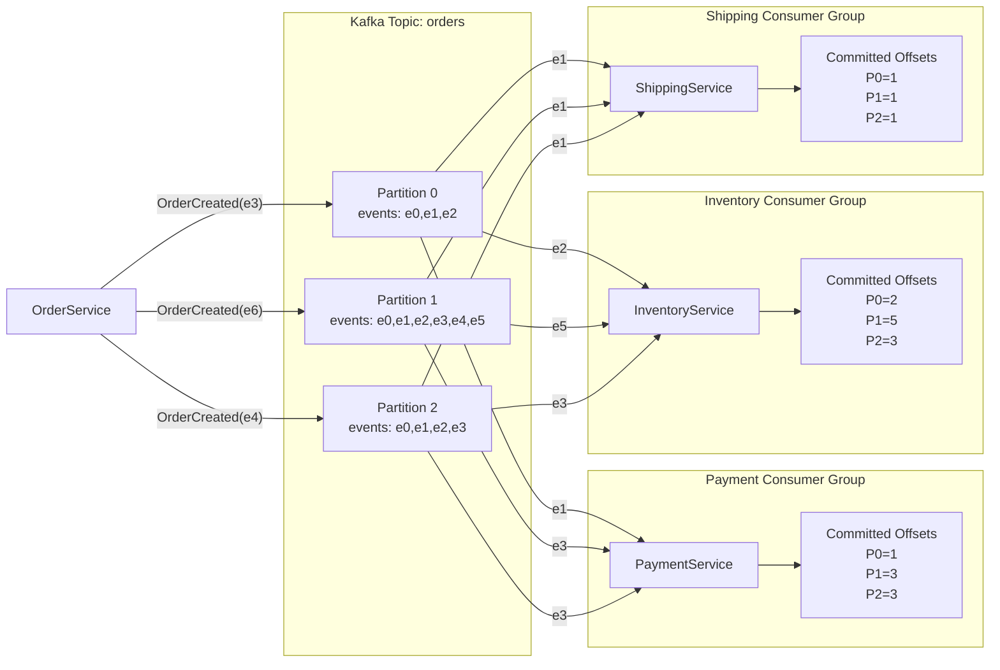

# Zadatak: Sustav za online narudžbe

```mermaid
flowchart LR

    P[OrderService]

    subgraph Kafka Topic: orders
        P0["Partition 0
            events: e0,e1,e2"]
        P1["Partition 1
            events: e0,e1,e2,e3,e4,e5"]
        P2["Partition 2
            events: e0,e1,e2,e3"]
    end

    P -->|"OrderCreated(e3)"| P0
    P -->|"OrderCreated(e6)"| P1
    P -->|"OrderCreated(e4)"| P2

    subgraph Payment Consumer Group
        Pay[PaymentService]
        PayOff["Committed Offsets<br/>P0=1<br/>P1=3<br/>P2=3"]
    end

    subgraph Inventory Consumer Group
        Inv[InventoryService]
        InvOff["Committed Offsets<br/>P0=2<br/>P1=5<br/>P2=3"]
    end

    subgraph Shipping Consumer Group
        Ship[ShippingService]
        ShipOff["Committed Offsets<br/>P0=1<br/>P1=1<br/>P2=1"]
    end

    P0 -->|"e1"| Pay
    P1 -->|"e3"| Pay
    P2 -->|"e3"| Pay
    Pay --> PayOff

    P0 -->|"e2"| Inv
    P1 -->|"e5"| Inv
    P2 -->|"e3"| Inv
    Inv --> InvOff

    P0 -->|"e1"| Ship
    P1 -->|"e1"| Ship
    P2 -->|"e1"| Ship
    Ship --> ShipOff
```
