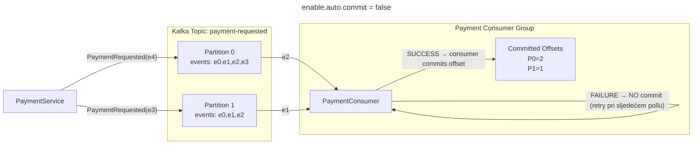

# Zadatak: Sustav za plaćanja s retry logikom

```mermaid
---
title: enable.auto.commit = false
---
flowchart LR

    P[PaymentService]

    subgraph Kafka Topic: payment-requested
        P0["Partition 0
            events: e0,e1,e2,e3"]
        P1["Partition 1
            events: e0,e1,e2"]
    end

    P -->|"PaymentRequested(e4)"| P0
    P -->|"PaymentRequested(e3)"| P1

    subgraph Payment Consumer Group
        C1[PaymentConsumer]
        State["Committed Offsets<br/>P0=2<br/>P1=1"]
    end

    P0 -->|"e2"| C1
    P1 -->|"e1"| C1

    C1 -->|"SUCCESS → consumer commits offset"| State

    C1 -->|"FAILURE → NO commit (retry pri sljedećem pollu)"| C1
```
