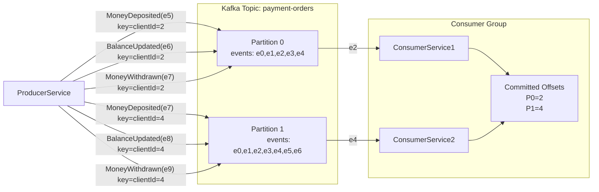

# Zadatak: Sustav sa striktno sekvencijalnim izvršavanjem

```mermaid
flowchart LR

    P[ProducerService]

    subgraph Kafka Topic: payment-orders
        P0["Partition 0
            events: e0,e1,e2,e3,e4"]
        P1["Partition 1
            events: e0,e1,e2,e3,e4,e5,e6"]
    end

    P -->|"MoneyDeposited(e5) key=clientId=2"| P0
    P -->|"BalanceUpdated(e6) key=clientId=2"| P0
    P -->|"MoneyWithdrawn(e7) key=clientId=2"| P0

    P -->|"MoneyDeposited(e7) key=clientId=4"| P1
    P -->|"BalanceUpdated(e8) key=clientId=4"| P1
    P -->|"MoneyWithdrawn(e9) key=clientId=4"| P1


    subgraph Consumer Group
        C1[ConsumerService1]
        C2[ConsumerService2]
        CLog["Committed Offsets<br/>P0=2<br/>P1=4"]
    end

    P0 -->|"e2"| C1
    P1 -->|"e4"| C2
    C1 --> CLog
    C2 --> CLog
```
