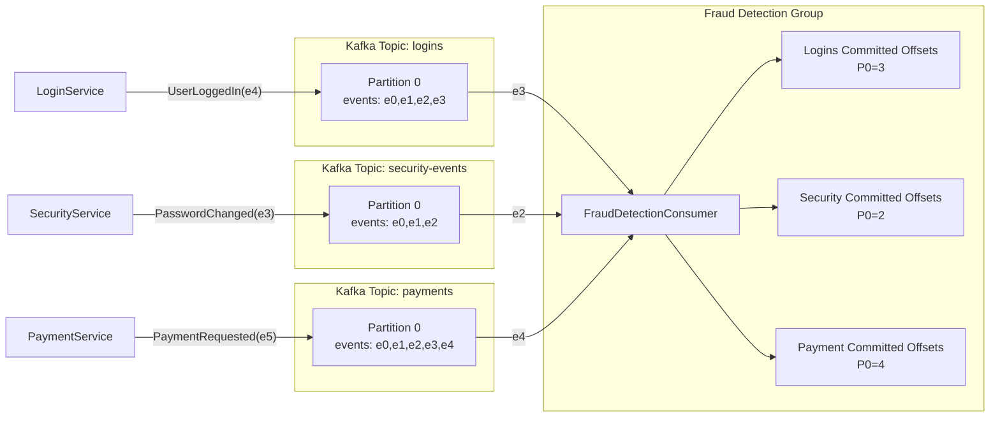

# Zadatak: Fraud Detection sustav

```mermaid
flowchart LR

    L[LoginService]
    S[SecurityService]
    P[PaymentService]

    subgraph Kafka Topic: logins
        L0["Partition 0
            events: e0,e1,e2,e3"]
    end

    subgraph Kafka Topic: security-events
        S0["Partition 0
            events: e0,e1,e2"]
    end

    subgraph Kafka Topic: payments
        P0["Partition 0
            events: e0,e1,e2,e3,e4"]
    end

    L -->|"UserLoggedIn(e4)"| L0
    S -->|"PasswordChanged(e3)"| S0
    P -->|"PaymentRequested(e5)"| P0

    subgraph Fraud Detection Group
        FD[FraudDetectionConsumer]
        LOff["Logins Committed Offsets</br>P0=3"]
        SOff["Security Committed Offsets</br>P0=2"]
        POff["Payment Committed Offsets</br>P0=4"]
    end

    L0 -->|"e3"| FD
    S0 -->|"e2"| FD
    P0 -->|"e4"| FD

    FD --> LOff
    FD --> SOff
    FD --> POff
```

## Povećanje broja resursa

Prvi topic - 2 particije

Drugi topic - 3 particije

Treci topic - 2 particije

3 Consumera
